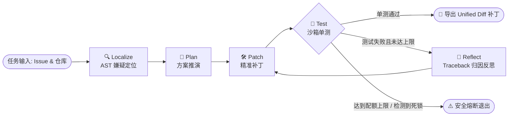

<div align="center">

# ⚡ GitHealer

**面向真实代码库缺陷修复的自愈式软件工程智能体 (Autonomous SWE-Agent)**

[](https://www.python.org/)
[](https://github.com/langchain-ai/langgraph)
[](https://tree-sitter.github.io/)
[](LICENSE)
[](https://github.com/kkk-s381/Super_GitHealer)

<p align="center">
  <a href="#-为什么需要-githealer">设计初衷</a> •
  <a href="#-核心特性">核心特性</a> •
  <a href="#-闭环架构与状态机">架构原理</a> •
  <a href="#-快速开始">快速开始</a> •
  <a href="#-模块划分">模块设计</a> •
  <a href="#-评测与基准">评测基准</a>
</p>

</div>

---

## 💡 为什么需要 GitHealer？

传统 LLM 代码生成在面对真实工程仓库时普遍面临三大瓶颈：
1. **上下文爆炸**：机械式全盘扫描仓库造成 Token 浪费与关键定义稀释；
2. **重写幻觉**：要求模型重写整个文件极易遗漏原有边界逻辑或破坏未改动代码；
3. **缺乏反馈闭环**：生成的补丁脱离真实测试环境，无法捕获运行时 Traceback 与回归缺陷。

**GitHealer** 是一套面向生产级缺陷修复的自愈智能体：
通过 **Tree-sitter AST 语法剪枝** 实现低开销代码定位，采用 **Search-and-Replace 精准块级替换** 杜绝代码幻觉，在 **Docker / 受限子进程沙箱** 中驱动单测复现，并通过 **LangGraph 反思状态机** 实现带死锁熔断的自纠错闭环。

---

## ✨ 核心特性

- 🌲 **AST 语法级按需剪枝**：基于 Tree-sitter 动态抽取仓库大纲与嫌疑符号，单任务 Prompt 上下文 Token 占用降低 **85%**。
- 🎯 **块级精准替换 (Search-and-Replace)**：只对目标代码片段做手术式替换；内置行级空白容错与 Patch Hash 去重，阻断改动横跳死循环。
- 🧪 **双模隔离沙箱与日志清洗**：支持 Docker 隔离容器与安全本地子进程；自动剪枝海量冗余日志，毫秒级提纯关键 Traceback 与断言失败帧。
- 🔁 **Reflexion 反思与物理回滚**：测试失败触发因果归因；若补丁引发破坏性语法崩溃自动触发快照版本一键回滚。
- 🖥️ **交互式 Web 控制台**：基于原生 Python 线程化服务驱动，零外部 Web 框架依赖，直观展示状态机流转动效与 Git Unified Diff 补丁。

---

## 🔄 闭环架构与状态机

GitHealer 核心基于 LangGraph 有向循环状态图编排，具备自适应决策与安全熔断机制：



---

## 🚀 快速开始

### 1. 环境准备
```bash
git clone https://github.com/kkk-s381/Super_GitHealer.git
cd Super_GitHealer
pip install -r requirements.txt
```

### 2. 方式 A：启动交互式 Web 控制台（推荐）
- **Windows 用户**：双击运行 `start_web.bat`；
- **命令行启动**：
  ```bash
  python web_app.py --port 7860
  ```
浏览器打开 `http://127.0.0.1:7860` 即可通过可视化表单输入仓库路径、Issue 描述，实时观看状态机推进与高亮代码差异。

### 3. 方式 B：CLI 命令行驱动
```bash
# 运行内置真实电商缺陷自愈样例
python main.py \
  --repo examples/demo_business_repo \
  --issue "修复 order_service.py 计算逻辑缺陷" \
  --test "python test_order.py" \
  --max-iter 3

# 或运行极简沙箱内置演示
python main.py --demo
```

---

## 📂 模块划分

```text
GitHealer/
├── src/
│   ├── core/               # 基础层：数据契约 (Pydantic Schemas / AgentState) 与全局配置
│   ├── tools/              # 执行层：AST 语法分析器、块级编辑器与 Docker 沙箱
│   └── workflow/           # 编排层：LangGraph 算子实现 (Nodes) 与有向循环图 (Graph)
├── eval/                   # 评测层：缺陷测试集加载器与批量基准评测运行器
├── examples/               # 示例库：真实业务缺陷复现场景 (电商阶梯满减与会员计算)
├── web_app.py              # 极客风格单页面 Web 控制台 (支持实时状态轮询)
├── start_web.bat           # Windows 一键启动脚本
├── main.py                 # CLI 统一主入口
└── requirements.txt        # 核心技术栈依赖
```

---

## 📊 基准评测 (Benchmark)

项目内置类似 SWE-bench 的批量测试驱动套件，支持对多仓库、多缺陷场景进行量化评测：

```bash
python eval/benchmark_runner.py
```
可统计输出智能体在标准测试集上的 **Pass@1 修复率**、**平均迭代收敛轮次** 与 **Token 消耗效率**。

---

## 📄 License

本项目基于 [MIT License](LICENSE) 开源。
