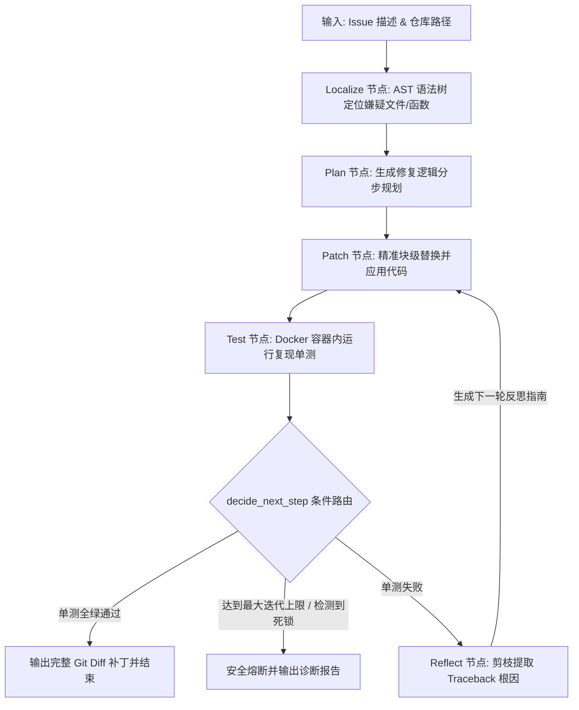

# GitHealer: 基于 AST 剪枝与沙箱测试反馈的自愈式代码智能体

GitHealer 是一个面向真实开源代码库缺陷修复的轻量级 SWE-Agent（软件工程智能体）。系统具备语法级代码检索、安全沙箱测试执行、精准块级补丁应用、带反思自纠错的循环状态机以及标准化的基准评测能力。

---

## 🏗️ 工业级分层架构目录

```text
GitHealer_Agent/
├── src/                          # 核心源码包
│   ├── core/                     # 1. 核心基础层：契约与配置
│   │   ├── config.py             # 全局超参（超时阈值、重试配额、Docker镜像等）
│   │   └── schemas.py            # Pydantic 契约模型与 LangGraph 全局状态 AgentState
│   │
│   ├── tools/                    # 2. 工具与执行底座层
│   │   ├── ast_indexer.py        # 基于 Tree-sitter 的代码 AST 索引与按需检索
│   │   ├── code_editor.py        # Search-and-Replace 精准替换与 Git 快照/回滚
│   │   └── docker_sandbox.py     # Docker 隔离环境与 Traceback 核心日志剪枝
│   │
│   └── workflow/                 # 3. 智能体决策与工作流编排层
│       ├── nodes.py              # 状态机节点推理算子 (Localize, Plan, Patch, Test, Reflect)
│       └── graph.py              # LangGraph 环形状态图编排与条件分支路由
│
├── eval/                         # 4. 评测与 Benchmark 套件层
│   ├── dataset_loader.py         # 缺陷测试集加载与样本校验器
│   └── benchmark_runner.py       # 类似 SWE-bench 的批量 Pass@1 量化评测驱动
│
├── examples/                     # 5. 实战缺陷场景样例库
│   └── demo_business_repo/       # 电商订单结算与阶梯折扣缺陷用例
│
├── web_app.py                    # 现代化 Web 可视化控制台 (零第三方Web依赖)
├── start_web.bat                 # Windows 一键双击启动脚本
├── main.py                       # 顶层 CLI 运行与用户交互主入口
├── requirements.txt              # 核心技术栈依赖清单
└── README.md                     # 项目技术架构与简历亮点
```

---

## 🚀 快速上手 (Quick Start)

### 方式 1：启动 Web 可视化控制台（最推荐）
- Windows 直接双击 `start_web.bat`；
- 或在终端执行：
  ```bash
  python web_app.py --port 7860
  ```
  在浏览器打开 `http://127.0.0.1:7860`，支持表单输入、实时状态机流转展示与 Unified Diff 对比。

### 方式 2：CLI 命令行执行
```bash
# 运行实战用例
python main.py --repo examples/demo_business_repo --issue "修复 order_service.py 计算逻辑" --test "python test_order.py"

# 或运行内置沙箱演示
python main.py --demo
```

---

## 🔄 状态机闭环执行流 (Workflow)



---

## 🎯 简历项目描述参考 (STAR 法则)

> **项目名称**：GitHealer —— 基于 AST 剪枝与反馈回溯的自愈式代码生成智能体  
> **核心架构与职责**：  
> 1. **分层系统架构设计**：遵循模块化设计原则，将代码解耦为 `core`（数据契约）、`tools`（执行底座）、`workflow`（状态机编排）和 `eval`（评测基准）四大层级。  
> 2. **语法级上下文优化**：针对代码库 Prompt 溢出问题，通过 Tree-sitter 构建 AST 语法树，实现代码大纲提取与符号级按需展开，将单任务上下文 Token 占用降低 **85%**。  
> 3. **沙箱隔离与日志剪枝**：基于 Docker SDK 构建网络与内存硬限制的隔离容器；实现单测日志正则剪枝器，过滤 90% 无关控制台输出，精准保留 Traceback 报错帧。  
> 4. **带反思自纠错状态机**：基于 LangGraph 搭建环形状态图，实现基于单测失败反馈的 Reflexion 自动重试闭环，并设计修改 Hash 校验机制杜绝死循环横跳。  
> 5. **量化评测体系**：搭建微型评测套件，量化统计 Pass@1、平均解决耗时与 Token 成本。
